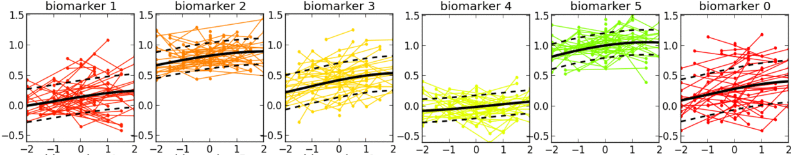

# EuroPOND software tools

This repository contains software tools for modeling progression of diseases, developed within the [EuroPOND](http://www.europond.eu) project (European Progression of Neurological Diseases, funded by the European Union’s Horizon 2020 research and innovation programme under grant agreement No. 666992).

These software tools allow building signatures of disease progression, studying their variability and heterogeneity within and between populations, and staging of individual patients. They take as inputs various types of medical measurements (clinical/cognitive scores, biomarker measurement, medical images, anatomical shapes, demographics, risk factors, ...). While mainly developed for neurological diseases, they are potentially applicable to other progressive disorders, such as lung diseases.

## EBM (Event-Based Model)

- **EBM** is a software tool for estimating models of progression from cross-sectional measurements.
- **Examples of applications in neurological diseases:** learning sequences, with uncertainty, of cumulative abnormality *events* (normal->abnormal) over the full time course of a disease, including: clinical/cognitive scores, fluid biomarker measurements (e.g. cerebrospinal fluid, blood), imaging biomarkers (volumetric MRI, cortical thickness, FDG PET, amyloid PET, diffusion MRI).
- **Links**
  - [Repository](https://github.com/EuroPOND/ebm)
- **Type of inputs:** cross-sectional scalar measurements
- **Related publications**
  - **Robust Model** - Young, et al. A data-driven model of biomarker changes in sporadic Alzheimer's disease. *Brain* 137:2564, May 2014 [Open Access link](https://doi.org/10.1093/brain/awu176)
  - **Original Model** - Fonteijn, et al. An event-based model for disease progression and its application in familial Alzheimer's disease and Huntington's disease. *NeuroImage* 60:1880, January 2012 [link](https://doi.org/10.1016/j.neuroimage.2012.01.062) (Erbsmann Prize winner: [IPMI 2011](https://doi.org/10.1007/978-3-642-22092-0_61))
- **Description:** This software package implements the event-based model --- a simple, robust tool for the estimation of the most likely sequence of events in a progressive (montonic) process, such as a neurodegenerative disease. Uniquely, this is achieved using cross-sectional data --- requiring only a single visit per individual. The resulting disease signature is a probabilistic sequence of discrete events useful for fine-grained staging across the full time course of the process.

## pyEBM

- **pyEBM** is a software toolbox for estimating event-based models of progression from cross-sectional measurements. The toolbox consists of a collection of algorithms for mixture modeling, obtaining the ordering, and patient staging.
- **Links**
  - [Repository](https://github.com/88vikram/pyebm/)
  - [Documentation](https://github.com/88vikram/pyebm/blob/master/README.md)
- **Related publications**
  - Venkatraghavan V., Bron E.E., Niessen W., Klein S. ‘[Disease Progression Timeline Estimation for Alzheimer's Disease using Discriminative Event Based Modeling](https://arxiv.org/abs/1808.03604)’, Manuscript Submitted.
- **Description:** This software package implements a toolbox of event-based models, including the discriminative EBM (dEBM) which takes a different approach to the original EBM (above).

## Leasp (LEArning Spatiotemporal Patterns)

- **Leasp** is a software tool for estimating models of progression from longitudinal measurements.
- **Examples of applications in neurological diseases:** learning trajectories of progression for clinical/cognitive scores, fluid biomarker measurements (e.g. CSF, blood), volumetric MRI measures, other regional neuroimaging measures (e.g. FDG PET, Amyloid PET), cortical thickness maps...   
- **Links**
  - [Repository](https://gitlab.icm-institute.org/aramislab/leasp)
  - [Documentation](https://gitlab.icm-institute.org/aramislab/leasp/blob/master/README.md)
- **Type of inputs:** longitudinal scalar measurements (e.g. clinical/cognitive scores, biomarker measurements) or network-valued measurements (e.g. cortical thickness map, PET SUVR projected onto the cortical surface...)
- **Related publications**
  - **Generic model** - Jean-Baptiste Schiratti, Stéphanie Allassonnière, Olivier Colliot, and Stanley Durrleman. A Bayesian mixed-effects model to learn trajectories of changes from repeated manifold-valued observations.
*The Journal of Machine Learning Research*, 18:1–33, December 2017. [Open Access PDF](https:
//hal.archives-ouvertes.fr/hal-01540367).
  - **Model for network-valued measurements** - Igor Koval, Jean-Baptiste Schiratti, Alexandre Routier, Michael Bacci, Olivier Colliot, Stéphanie Allassonnière, and Stanley Durrleman. Spatiotemporal Propagation of the Cortical Atrophy: Population and Individual Patterns. *Front Neurol.* 2018 May 4;9:235. [Open Access link](https://www.frontiersin.org/articles/10.3389/fneur.2018.00235/full).
- **Description:** This software package implements a generic Bayesian mixed-effects model to estimate the temporal progression of a biological phenomenon from observations obtained at multiple time points for a group of individuals. The progression is modeled by continuous trajectories in the space of measurements. Individual trajectories of progression result from spatiotemporal transformations of an average trajectory. These transformations allow to quantify the changes in direction and pace at which the trajectories are followed. The framework of Riemannian geometry allows the model to be used with any kind of measurements with smooth constraints. A stochastic version of the Expectation-Maximization algorithm is used to produce maximum a posteriori estimates of the parameters.

## Deformetrica

- Models of progression from longitudinal shape or image data are implemented in the **Deformetrica** software package. Deformetrica also implements various other functionalities for statistics on shapes and images, including registration, atlas construction and geodesic regression.
- **Type of inputs:** longitudinal shapes or images (e.g. meshes of anatomical structures)
- **Examples of applications in neurological diseases:** learning trajectories of atrophy of anatomical shapes (e.g. hippocampal shape extracted from anatomical MRI)
- **Links**
  - [Website](http://www.deformetrica.org/)
  - [Repository](https://gitlab.icm-institute.org/aramislab/deformetrica)
  - [Documentation](https://gitlab.icm-institute.org/aramislab/deformetrica/wikis/home)
- **Related publications**
  - **Model for longitudinal shape data** - Alexandre Bône, Olivier Colliot, and Stanley Durrleman. Learning distributions of shape trajectories
from longitudinal datasets: a hierarchical model on a manifold of diffeomorphisms. *In CVPR 2018 - Computer Vision and Pattern Recognition 2018*, Salt Lake City, United States, June 2018. [Open Access link](https://hal.archives-ouvertes.fr/hal-01744538).
  - **Generic description of Deformetrica** - Alexandre Bône, Maxime Louis, Benoît Martin, Stanley Durrleman, Deformetrica 4: an open-source software for statistical shape analysis, *In Proc ShapeMI Workshop, MICCAI 2018*, Sep 2018, Granada, Spain [Open Access link](https://hal.inria.fr/hal-01874752v2).
- **Description:** The implemented approach allows to learn a distribution of shape trajectories from longitudinal data, i.e. the collection of individual objects repeatedly observed at multiple time-points. It can in particular be applied to any series of anatomical shapes (represented as meshes) extracted from medical images. The method allows to compute an average spatiotemporal trajectory of shape changes at the group level, and the individual variations of this trajectory both in terms of geometry and time dynamics. The model is formulated as the combination of a generic statistical model for manifold-valued longitudinal data, a deformation model defining shape trajectories via the action of a set of diffeomorphisms with a manifold structure, and an efficient numerical scheme to compute parallel transport on this manifold.

## pySuStaIn (Subtype and Stage Inference)

- **SuStaIn** is a software tool for performing **Su**btype and **Sta**ge **In**ference to estimate subtype models of progression from cross-sectional measurements.
- **Examples of applications in neurological diseases:** learning probabilistic sequences *for multiple subtypes* of cumulative abnormality over the full time course of a disease, including: clinical/cognitive scores, fluid biomarker measurements (e.g. cerebrospinal fluid, blood), imaging biomarkers (volumetric MRI, cortical thickness, FDG PET, amyloid PET, diffusion MRI).
- **Links**
  - [Repository](https://github.com/EuroPOND/PySustain)
- **Type of inputs:** cross-sectional scalar measurements
- **Related publication**
  - **Original Model** - Young, et al. Uncovering the heterogeneity and temporal complexity of neurodegenerative diseases with Subtype and Stage Inference. *Nature Communications* 9:221, October 2018 [Open Access link](https://doi.org/10.1038/s41467-018-05892-0)
- **Description:** This software package is a python implementation of the [original SuStaIn code (MATLAB)](https://github.com/ucl-mig/SuStaInMatlab). The package infers disease subtypes and their progression patterns from cross-sectional datasets --- requiring only a single visit per individual. The resulting disease signature is a set of probabilistic sequences of discrete events useful for fine-grained subtyping and staging across the full time course.

## DEM (Differential Equation Model)

- **DEM** is a software tool for estimating group-level long-term (decades) biomarker trajectories from individual-level short-term (a few years) longitudinal measurements.
- **Examples of applications in neurological diseases:** learning group-level probabilistic trajectories over the full time course of a disease (decades), having accesss to only a couple of years per individual. Good for scalar biomarkers such as: clinical/cognitive scores, fluid biomarker measurements (e.g. cerebrospinal fluid, blood), imaging biomarkers (volumetric MRI, cortical thickness, FDG PET, amyloid PET, diffusion MRI).
- **Links**
  - [Repository](https://github.com/EuroPOND/pyDEM)
  - [Documentation](https://github.com/EuroPOND/pyDEM/blob/master/README.md)
- **Type of inputs:** a panel of short-term longitudinal scalar biomarker measurements (at least two data points per individual).
- **Related publication**
  - **Nonparametric Model** - Oxtoby, et al. Data-driven models of dominantly-inherited Alzheimer's disease progression. *Brain* 2018 [Open Access link](https://doi.org/10.1093/brain/awy050)
  - **Original Model** - Oxtoby, et al. Learning Imaging Biomarker Trajectories from Noisy Alzheimer's Disease Data Using a Bayesian Multilevel Model. *In: **B**ayesian and gr**A**phical **M**odels for **B**iomedical **I**maging. Lecture Notes in Computer Science.* 2014 [Publication link](https://doi.org/10.1007/978-3-319-12289-2_8)
- **Description:** This software tool uses a differential equation idea to estimate a long-term trajectory from short-term measurements: fitting rate-of-change as a function of score/value. The resulting signature is a set of probabilistic nonparametric trajectories of continuous measures. This is useful in neurodegenerative disease applications for data-driven, probabilistic, biomarker-based patient staging, e.g., for predicting decline and disease onset.

## DIVE (Data-driven Inference of Vertexwise Evolution)

- **DIVE** is a software tool for estimating clusters of disease progression patterns in the brain, at the vertex level (e.g., individual voxels) from longitudinal measurements.
- **Examples of applications in neurological diseases:** learning clusters of probabilistic trajectories of cumulative abnormality across the brain surface (cortex) over the full time course of a disease. The clustering imposes no spatial correlation assumptions, so it can be used for data-driven discovery of progression patterns that aren't limited by any given brain parcellation atlas. It was designed to estimate cortical abnormality in the human brain, e.g., cortical thickness, or amyloid deposition --- hallmarks of Alzheimer's disease.
- **Links**
  - [Repository](https://github.com/EuroPOND/dive)
- **Type of inputs:** longitudinal vertex-wise measurements, e.g., grey-matter thickness or amyloid deposition across the brain's cortical surface.
- **Related publication**
  - **Original Model** - Marinescu, et al. A vertex clustering model for disease progression: Application to cortical thickness images. *Information Processing in Medical Imaging (IPMI)* 2017 [Open Access link](http://www.homepages.ucl.ac.uk/~rmaprvm/MarinescuIPMI2017.pdf) [Proceedings](https://doi.org/10.1007/978-3-319-59050-9_11)
- **Description:** This software package clusters vertex-wise data to infer common trajectories of biological measurements. The resulting signature is a set of probabilistic trajectories of continuous measures. This is useful in neurodegenerative disease applications for data-driven, biomarker-based patient staging that is not restricted by predefined atlases of regions of interest in the human brain.

## Gaussian Process regression models (with latent-time shift)

- This is a software tool for estimating a set of group-level long-term biomarker trajectories as a function of unknown disease time (estimated by the tool), by combining short-term longitudinal measurements from individuals.
- **Examples of applications in neurological diseases:** simultaneously learning group-level probabilistic trajectories and a reparameterised disease time (age + disease-related time-shift), over the full time course of a disease, for scalar biomarkers such as: clinical/cognitive scores, fluid biomarker measurements (e.g. cerebrospinal fluid, blood), imaging biomarkers (volumetric MRI, cortical thickness, FDG PET, amyloid PET, diffusion MRI).
- **Links**
  - [Repository](https://github.com/EuroPOND/GP_progression_model)
  - [Documentation](https://github.com/EuroPOND/GP_progression_model/blob/master/README.md)
- **Type of inputs:** a panel of longitudinal or cross-sectional scalar biomarker measurements.
- **Related publication**
  - **Original Model** - Lorenzi, et al. Probabilistic disease progression modeling to characterize diagnostic uncertainty: Application to staging and prediction in Alzheimer's disease. *NeuroImage* 2018 [Publication link](https://doi.org/10.1016/j.neuroimage.2017.08.059)
- **Description:** This software tool iteratively estimates monotonic progressions for each biomarker and realigns the individual observations in time, using a single time-shift per person. The resulting signature is a set of probabilistic nonparametric trajectories of continuous measures. This is useful in neurodegenerative disease applications for data-driven, probabilistic, biomarker-based patient staging.

## Clinica

- **Clinica** allows extracting measurements (volumetric and other regional measures, voxel-based maps, cortical thickness, meshes...) from brain imaging data. It also allows converting public datasets (ADNI, AIBL, OASIS) into the standard community format BIDS.
- **Type of inputs:** neuroimaging data (anatomical MRI, diffusion MRI, PET).
- **Examples of applications:** extracting measurements that can then be used as inputs of disease progression modeling software (e.g [EBM](EBM), [pyEBM](pyEBM), [Leasp](Leasp), [Deformetrica](Deformetrica)...)
- **Links**
  - [Website](http://www.clinica.run/)
  - [Repository](https://gitlab.icm-institute.org/aramislab/clinica)
  - [Documentation](http://www.clinica.run/doc/)
- **Related publications**
  - **General presentation of Clinica software** - Alexandre Routier, Jérémy Guillon, Ninon Burgos, Jorge Samper-Gonzalez, Junhao Wen, Sabrina
Fontanella, Simona Bottani, Thomas Jacquemont, Arnaud Marcoux, Pietro Gori, Pascal Lu, Tristan Moreau, Michael Bacci, Stanley Durrleman, and Olivier Colliot. Clinica: an open source software
platform for reproducible clinical neuroscience studies. *In Annual meeting of the Organization for Human Brain Mapping - OHBM 2018*, Singapore, Singapore, June 2018. [Open Access link](https://hal.inria.fr/hal-01760658).
  - **T1 MRI and PET applications** - Jorge Samper-Gonzalez, Ninon Burgos, Simona Bottani, Sabrina Fontanella, Pascal Lu, Arnaud Marcoux,
Alexandre Routier, Jérémy Guillon, Michael Bacci, Junhao Wen, Anne Bertrand, Hugo Bertin, Marie-Odile Habert, Stanley Durrleman, Theodoros Evgeniou, and Olivier Colliot. Reproducible
evaluation of classification methods in Alzheimer’s disease: Framework and application to MRI and PET data. *NeuroImage*, 183:504–521, December 2018. [Open Access link](https://hal.inria.fr/hal-01858384).
- **Description:** Clinica is a software platform for multimodal brain image analysis in clinical research studies. It makes it easy to apply advanced analysis tools to large scale clinical studies. For that purpose, it integrates a comprehensive set of processing tools for the main neuroimaging modalities: currently MRI (anatomical, functional, diffusion) and PET, in the future, EEG/MEG.
For each modality, Clinica allows to easily extract various types of features (regional measures, parametric maps, surfaces, curves, networks). Such features are then subsequently used as input of machine learning, statistical modeling, morphometry or network analysis methods. Processing pipelines are based on combinations of freely available tools developed by the community. It provides an integrated data management specification to store raw and processing data. Clinica is written in Python. It uses the Nipype system for pipelining. It combines widely-used software for neuroimaging data analysis (SPM, Freesurfer, FSL, MRtrix...), morphometry (Deformetrica), machine learning (Scikit-learn) and the BIDS standard for data organization.
